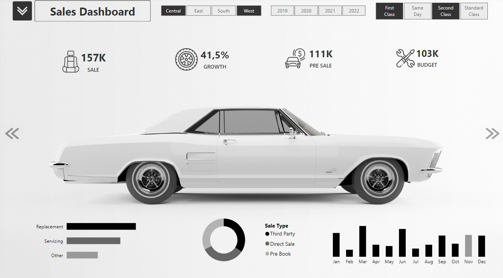

# Car Sales Dashboard Visualization with Power BI

Welcome to the Car Sales Dashboard Visualization project! This repository contains a Power BI project designed to visualize data related to car sales performance, providing insightful analysis for informed decision-making.

## Overview

The Car Sales Dashboard Visualization project aims to deliver a comprehensive view of key sales metrics, allowing users to explore trends, identify opportunities, and track progress towards targets. By leveraging Power BI's interactive features, this dashboard empowers users to delve into various aspects of the car sales business in a visually appealing and intuitive manner.

## Features

- **Interactive Dashboards**: Explore car sales data through interactive dashboards and visualizations, enabling dynamic exploration of key performance indicators (KPIs).
- **Sales Performance Analysis**: Analyze crucial metrics such as total sales, sales growth, pre-sales, and budget attainment, with filtering options for year and region.
- **Sales Breakdown**: Gain insights into sales distribution across different categories, including "Pre-Book", "Direct Sale", and "Third Party", to understand the contribution of each channel.
- **Service Performance**: Monitor the volume of services rendered, such as "Replacement", "Servicing", and "Other", identifying potential avenues for revenue growth through customer retention.
- **Monthly Trend Analysis**: Track sales performance on a monthly basis, visualizing peaks and dips to inform seasonal strategies and promotional campaigns.
- **Advanced Segmentation**: Leverage filters for region (Central, East, West) and car class (First Class, Same Day, Standard) to understand market dynamics and tailor sales approaches.

## Power BI Page 01

## Power BI Page 02

## Power BI Page 03

This Car Sales Dashboard, powered by Power BI, provides a comprehensive and insightful tool for anyone involved in the automotive sales industry. It empowers users to make data-driven decisions, optimize sales strategies, and drive business growth. 

---

<i>Contato</i>  
 

